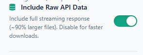
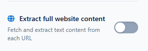

# Data Collection Workflow

End-to-end pipeline for reproducing a study wave: collect ChatGPT/Gemini responses, scrape the Bing/Google results behind them, match, and enrich. Each step lists its **input**, the **tool/command**, and the **output** with a real sample.

> 🎥 **Video walkthrough:** [`docs/methodology-walkthrough.mp4`](docs/methodology-walkthrough.mp4) — the ChatGPT capture and Bing scrape steps, recorded end to end (with subtitles).

> **Tip:** the easiest way to work with this is opening the entire repo in Claude Code (that's my setup) — it helps a lot with navigating the pipeline and the data.

> **Where things live:** this repo (the data viewer) bundles the **browser extensions** (`tools/`), the **v1 study data** (`datapass/`, `data/`), the viewer, and the **Node/Python collection + enrichment scripts** under `scripts/` (SerpApi collector, citation-mapping, fan-out extractor, content fetcher, DNA labelers). They expect to run from a repo root with the `data/` and `datapass/` layout shown below, and all API keys are read from environment variables (`SERPAPI_API_KEY`, `GEMINI_API_KEY`, `OPEN_AI_KEY`).

---

## 0. Setup

| Thing | Value |
|---|---|
| **US proxy** | Windscribe **browser extension** ([Chrome Web Store](https://chromewebstore.google.com/detail/free-vpn-for-chrome-vpn-e/hnmpcagpplmpfojmgmnngilcnanddlhb?hl=en) — listed as "Free VPN for Chrome"), location **Atlanta – Peachtree**. Apply to the browser tools (ChatGPT scraper, Bing tools). Without it, ChatGPT injects non-US localized searches. |
| **Accounts** | One ChatGPT **Business** (enterprise/edu tier), one **Plus** (consumer). Always run in **Temporary Chat**. |
| **API keys** | `SERPAPI_API_KEY` (Google). `GEMINI_API_KEY` (for the DNA classifier / Gemini path). `OPEN_AI_KEY` (for the GPT-5-mini DNA labeler). |
| **Extensions** | Load unpacked from `tools/` at `chrome://extensions` → Developer mode → Load unpacked. |

SerpApi (Google) sets US locale **in code** (`location: "United States"`), so it does **not** use the Windscribe proxy. Browser tools do.

---

## 1. Collect ChatGPT responses — `tools/ChatGPT Response Scraper`

**This is the primary extractor.** No manual DevTools needed.

> ⚙️ **Toggle on "Include Raw API Data"** in the extension before running. This captures the full streaming network response (`raw_api_response_json`), which is where the GPT-5.5 `result_source` / `ref_index` provider data lives. Files are ~90% larger, but the rich citation analysis depends on it. Leave it off only if you want faster, lighter downloads and don't need the raw payload.
>
> 

**Input** — `prompt_id,query` CSV (`tools/ChatGPT Response Scraper/input_template.csv`):
```
prompt_id,query
P0001,What are some free AI tools for audio transcription?
```
Run each tier **separately**, **3 runs per prompt**, in Temporary Chat + proxy.

**Output** — one CSV row per run. Key columns:
```
prompt_id, run_number, query, generated_search_query,
hidden_queries_json,            # the fan-out queries (feeds steps 3–4)
content_references_json,        # the rich citation data (provider, rank, channel)
sources_cited_json,             # inline citations (read from the DOM "More" divider)
sources_additional_json,        # "More" panel links (DOM)
resolved_model_slug,            # which model actually answered — CHECK THIS
response_text, web_search_triggered, sonic_classification_json
```

**`content_references_json` → items** carry the per-citation ground truth (this is the rich part):
```json
{
  "url": "https://www.synthesia.io/post/best-video-translator-apps",
  "result_source": "bing",                                  // provider: bing | bright | labrador | serp  (GPT-5.5+ only)
  "refs": [{"turn_index":0,"ref_type":"search","ref_index":3}], // ref_type = channel; ref_index = rank in provider's list
  "title": "10 Best AI Video Translation Tools of 2026"
}
```
- `result_source` = the actual retrieval provider. **Exists only in GPT-5.5+.**
- `ref_type` = channel (search / news / academia / product).
- `ref_index` = the rank the provider returned the result at (0-based).

---

## 1b. Build citation mappings — `scripts/extract_citation_mappings.mjs`

Turns the raw network captures into per-run **claim-to-source** mappings (used for the semantic-fidelity / attribution analysis).

**Input** — `datapass/raw_network_responses/` (raw captures) + the ChatGPT results CSV.

```bash
node scripts/extract_citation_mappings.mjs
```

**Output** — one JSON per run in `datapass/citation_mappings/{run}_mapping.json`:
```json
{
  "run_id": "P001_r1", "account_type": "enterprise",
  "prompt": "Which free AI would you recommend for translating my video?",
  "metadata": { "hidden_queries": [...], "sonic_classification": { "simple_search_prob": 0.97, ... } },
  "citation_mappings": [ { "url": "...", "claim_text": "...", "source": {...} } ],
  "source_summary": {...}, "response_stats": {...}
}
```

> **Note:** this script resolves each citation's source via `search_result_groups`, which was fully populated in **GPT-5.2**. On **GPT-5.5** that field is near-empty (the data moved into `content_references` items with `result_source`/`ref_index`), so the script needs adapting to read sources from `content_references` for newer waves.

---

## 2. Extract fan-out queries

From each run's `hidden_queries_json`. These — not the original prompt — are what you scrape the engines for.

**Sample:**
```json
["best free AI video translation tools 2026 dubbing subtitles"]
```

Build the Bing scraper's `run_id,query` CSV automatically with `scripts/build_bing_input.py`:
```bash
python scripts/build_bing_input.py --chatgpt chatgpt_results_<ISO>.csv
# -> chatgpt_results_<ISO>_bing_input.csv
```
```
run_id,query
P0031_r1,free audio to text transcription services 2026 free tier Whisper TurboScribe Otter
P0076_r1,best free AI video translator 2026 video translation dubbing HeyGen Captions Rask AI free plan
```
It pulls every fan-out query (one row each), skips runs that never searched, and **zero-pads `prompt_id` to `P0000` form** to match `normalize_and_match.py` (step 5) — otherwise the scrape won't line up with the citations at match time. For Gemini, use `extract_fanout_queries.mjs` instead (it reads `webSearchQueries` from the grounding metadata).

---

## 3. Scrape Bing — `tools/Bing Results Scraper`

Via proxy. This single tool collects Bing organic results **and**, optionally, page content, run to depth ~200 (Bing's pagination is unstable, so depth is required — displaced results scatter deep rather than moving to page 2).

> ⚙️ **Leave "Extract full website content" OFF here.** For the Bing scrape you only need the ranked URLs (metadata), so keep this toggle off — it's much faster and keeps the scrape focused on rankings. Fetch the actual page text later, in the content/DNA enrichment step (step 6), where it's only pulled for the URLs that actually got cited rather than every result to rank 200.
>
> 

**Input** — `run_id,query` CSV (the fan-out queries):
```
run_id,query
P0001_r1,best free AI video translation tools 2026 dubbing subtitles
```

**Output** — one row per result, with rank + page + content:
```
run_id, query, position, page_num, url, title, snippet, domain, content
P0001_r1, "best free AI video translation tools 2026", 1, 1, https://www.unite.ai/best-ai-video-translation-tools/, "10 Best AI Video Translation Tools...", "...", unite.ai, "<extracted page text>"
```

---

## 4. Scrape Google — `scripts/collect_serpapi_results.mjs`

```bash
SERPAPI_API_KEY=... node scripts/collect_serpapi_results.mjs --v3
```
`--v2`/`--v3` route to per-version output dirs so earlier waves aren't overwritten. ~28 organic results/query (≈2 pages) — Google is **not** scraped deep.

**Input** — by default it reads the fan-out queries from the citation mappings (`datapass/citation_mappings/`). To scrape a specific set instead, pass `--input <csv>` with columns `chatgpt_run_id,account,type,query` (`account` is the ChatGPT tier — Google is scraped per tier; `type` is `main` or `hidden_query`).

**Output** — one JSON per query in `data/serpapi_v3_google_results/`:
```json
{
  "_query_info": { "run_id":"P0001_r1_business_Q1", "chatgpt_run_id":"P0001_r1",
                   "account_type":"business", "query":"best free AI video translation tools 2026" },
  "organic_results": [ { "url":"...", "title":"5 Best AI video translator tools [2026]", "_global_position":1 } ]
}
```

---

## 5. Normalize + match — `scripts/normalize_and_match.py`

Check which **cited** URLs appear in the Bing/Google results for the same run → the overlap (and "invisible" rate), per tier. URLs are normalized first with one consistent rule across all waves so the numbers stay comparable: **lowercase, strip protocol + `www`, drop the query string and fragment, drop a trailing slash** (`https://www.example.com/page?id=5#x` → `example.com/page`).

```bash
python scripts/normalize_and_match.py     --chatgpt chatgpt_results_business.csv     --bing    bing_results_business.csv     --google-dir data/serpapi_v3_google_results     --account business     [--out matches.csv]
```

**Output** — % of cited links found in Bing, in Google, in either (coverage), and in neither (invisible), for that tier. `--out` writes a per-citation match table (`run_id, url, in_bing, in_google, covered`). Run once per tier.

> Use the **same normalization for every wave** — it matters. A stricter rule (keeping `www`/query params) undercounts overlap by ~2–5 points, which can look like a decline that's really just a matching artifact.

---

## 6. Content / DNA enrichment

For structural-feature analysis of cited (and additional) URLs.

1. **Node fetch** — `scripts/ingest/fetch_content_v2.mjs` (cheerio extraction → `data/fetched_content/{hash}.txt`). Skips wikipedia/reddit/arxiv/app-stores/social (handled by domain rule).
2. **URL Content Fetcher extension** (`tools/URL Content Fetcher`) — for the ~13% the Node fetcher 403s on. Input: CSV with a `url` column → outputs `content`, `page_title`, `meta_description`, etc.
3. **Classify** — LLM labeler with `prompts/page_label_dna_only_v1.txt` (GPT-5-mini / Gemini-Flash) → page type + structural features → append to `data/enrichment/full_url_dna_database.csv`.

**Labeling scripts:**
- `scripts/llm/enrich_control_gpt_full_content.mjs` — GPT-5-mini labeler over fetched content → `datapass/page_labels_control_gpt5_mini.jsonl`
- `scripts/llm/enrich_gemini_grounding.mjs` — Gemini 2.5 Flash labeler (same prompt) → `datapass/page_labels_gemini.jsonl`

Both judges read the page body from `data/fetched_content/{hash}.txt` (hash of the normalized URL) and return one JSON row per URL.

**DNA row** (per URL): `type, has_tables, has_numbered_lists, has_bullet_points, has_pros_cons, freshness_cue_strength, is_vendor_owned, primary_intent, tone, ...`

---

## 7. Gemini path (separate from ChatGPT)

- Responses via the **Vertex AI API** (Gemini 3.0 Flash) — grounding metadata is native (`webSearchQueries`, grounding chunks).
- **`tools/VertexResolverExtension`** resolves Vertex redirect URLs to real destinations.
- Google baseline via the same SerpApi collector (`--gemini` mode reads `webSearchQueries`).

---

## Validity checks before trusting a batch

- **ChatGPT scraper:** confirm the "More" divider was found (else the cited/additional split is wrong — the scraper logs `divider found/NOT found`); confirm `content_references` is non-empty.
- **Model routing:** check `resolved_model_slug` — the consumer tier sometimes routes ~⅓ of runs to a mini model (e.g. `gpt-5-3-mini`).
- **SerpApi cap:** ~28 organic/query including PAA & discussions

---

## Output conventions

| Treat as… | Files |
|---|---|
| **Raw evidence** | ChatGPT scraper CSVs, Bing scrape CSVs, SerpApi JSONs, `data/fetched_content/` |
| **Processed** | normalized/matched tables, `full_url_dna_database.csv` |
| **Viewer-only** | aggregates the viewer builds from the above |
